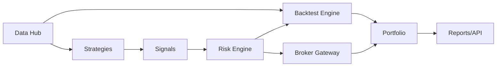

# 美股量化交易 MVP 技术架构

版本：v0.1  
日期：2026-04-26  
状态：初稿  

## 1. 架构目标

第一阶段目标是跑通美股日线策略闭环：

1. 导入美股日线行情。
2. 策略生成目标仓位信号。
3. 回测引擎用保守成本和滑点撮合。
4. 风控在订单生成前拦截不合规交易。
5. 输出净值、订单、成交和基础绩效。
6. 后续接入 Alpaca paper trading，但核心策略和回测逻辑不依赖 Alpaca。

## 2. 设计原则

1. 策略只产出信号，不直接下单。
2. 风控独立于策略，所有订单必须经过风控。
3. 券商适配器只负责账户、订单和成交，不承载策略逻辑。
4. 回测、模拟盘和实盘共享统一订单模型。
5. 数据源可替换，第一版不把系统绑定到单一供应商。
6. 默认只做多、不加杠杆、不做全自动实盘。

## 3. 模块边界

### 3.1 `data_hub`

职责：

1. 读取和标准化行情数据。
2. 提供按日期和标的索引的数据视图。
3. 后续接入 Alpaca、Polygon、Nasdaq Data Link。

第一版只实现内存数据和样例数据。

### 3.2 `strategies`

职责：

1. 定义策略接口。
2. 将历史行情和组合状态转换为目标仓位信号。
3. 保存策略参数和信号原因。

第一版实现 ETF 均线趋势策略。

### 3.3 `backtest_engine`

职责：

1. 按交易日推进回测。
2. 将目标仓位转换为订单。
3. 应用滑点、佣金和风控。
4. 记录订单、成交、净值和风控拒绝。

第一版使用日线收盘价撮合。策略在某日收盘后生成信号，下一交易日执行，避免同一根 K 线既生成信号又成交。

### 3.4 `risk_engine`

职责：

1. 检查单标的最大仓位。
2. 检查单笔订单金额。
3. 禁止做空。
4. 禁买名单拦截。
5. 后续扩展单日亏损、行业暴露、换手率和只平仓模式。

### 3.5 `broker_gateway`

职责：

1. 定义券商接口。
2. 第一版提供内存模拟券商。
3. 后续添加 Alpaca paper adapter 和 IBKR adapter。

### 3.6 `portfolio`

职责：

1. 维护现金、持仓和权益。
2. 生成净值序列。
3. 后续扩展绩效归因和报表。

## 4. 初始技术栈

| 层 | 选择 | 说明 |
| --- | --- | --- |
| 核心语言 | Python 3.9+ | 当前本机可用版本为 Python 3.9.6 |
| 核心包管理 | pyproject + setuptools | 保持轻量，后续可换 Poetry/uv |
| 测试 | unittest | 标准库可运行，减少初期依赖 |
| 数据处理 | 标准库起步 | 后续加入 pandas、DuckDB、Parquet |
| API | 暂缓 | 第二步再加 FastAPI |
| 前端 | 暂缓 | 回测核心稳定后再加 React 工作台 |

## 5. 数据流

1. `data_hub` 提供 `Bar` 列表。
2. `backtest_engine` 按日期聚合行情。
3. 策略读取截至当前日期的历史行情，生成下一交易日目标仓位。
4. 回测引擎在下一交易日按收盘价和滑点生成成交。
5. 风控拒绝或通过订单。
6. 组合服务更新现金、持仓和净值。
7. 回测结果输出成交、订单、风控拒绝和净值曲线。

## 6. 当前限制

1. 样例回测只支持日线。
2. 暂不处理拆股、分红和退市。
3. 暂不计算高级绩效指标。
4. 暂不接真实券商。
5. 暂不支持分钟线、做空、杠杆和盘前盘后。

这些限制是 MVP 的有意取舍，不是最终系统边界。

## 7. 下一步

1. 完善回测绩效指标：年化收益、最大回撤、夏普、换手率。
2. 加入 CSV/Parquet 数据读取。
3. 接 Alpaca Market Data。
4. 接 Alpaca paper trading。
5. 增加 FastAPI 接口。
6. 增加 Web 工作台。

