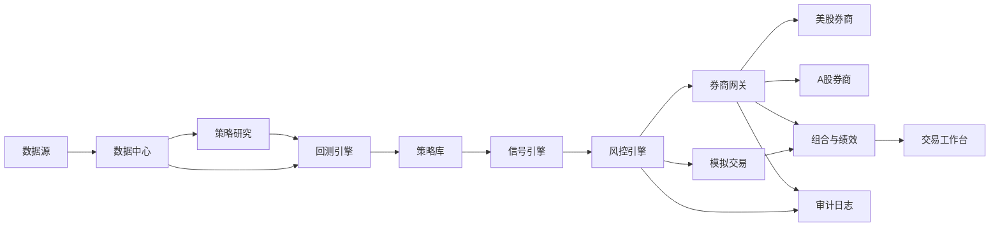

# 量化交易系统需求文档

版本：v0.1  
日期：2026-04-26  
状态：需求初稿，待确认  
适用市场：美股、A 股  

> 本系统用于量化研究、回测、模拟交易、风险控制和受控实盘执行，不构成投资建议。实盘交易前必须完成策略验证、账户权限确认、券商 API 联调、风控开关测试和小资金试运行。

## 1. 背景

用户希望建设一个可辅助买卖美股和 A 股的量化交易系统。系统需要覆盖从数据获取、策略研究、回测验证、模拟交易到实盘下单的完整流程，并能持续记录交易、评估绩效、控制风险。

由于美股和 A 股在交易时间、最小交易单位、涨跌停、T+0/T+1、融资融券、数据源、券商接口、结算规则和监管要求上存在明显差异，系统必须把“市场规则适配”作为核心能力，而不是简单复用同一套交易逻辑。

## 2. 产品目标

1. 建立一个统一的量化交易工作台，支持美股和 A 股的策略研究、回测、模拟盘和实盘交易。
2. 提供可复现的策略开发流程：数据版本、参数、回测结果、交易记录都可追踪。
3. 在进入实盘前，通过成本、滑点、参数扰动、样本外验证和压力测试筛选策略。
4. 实盘阶段优先保证风控、审计和可停止性，再追求自动化程度。
5. 支持从个人使用开始，后续可扩展为多账户、多策略、多市场的交易平台。

## 3. 非目标

1. 第一阶段不做高频交易、盘口微秒级撮合或 colocated execution。
2. 第一阶段不承诺自动生成稳定盈利策略。
3. 第一阶段不做社交跟单、资管产品销售或对外投顾服务。
4. 第一阶段不直接接入真实账户全自动交易，除非模拟盘和小资金试运行通过验收。
5. 第一阶段不覆盖期货、期权、港股、加密货币，除非后续明确扩展。

## 4. 用户角色

### 4.1 策略研究者

负责提出交易假设、编写策略、运行回测、分析绩效和迭代参数。

### 4.2 交易执行者

负责检查信号、确认订单、监控成交、处理异常，并在必要时手动暂停系统。

### 4.3 系统管理员

负责配置数据源、券商账户、密钥权限、任务调度、监控告警和备份恢复。

## 5. 市场范围

### 5.1 美股

需要支持：

1. 股票和 ETF。
2. 常规交易时段，后续可扩展盘前盘后。
3. 做多为第一优先级，做空和保证金交易作为后续扩展。
4. 美元计价资产、汇率换算、交易佣金和 SEC/FINRA 等费用建模。
5. 股票拆分、分红、退市、合并等公司行动处理。

候选券商接口：

1. Interactive Brokers。
2. Alpaca。
3. 其他支持 API 的美股券商。

### 5.2 A 股

需要支持：

1. 沪深 A 股和常见 ETF。
2. A 股交易日历、午间休市、集合竞价、连续竞价。
3. T+1 卖出约束。
4. 100 股整数手、涨跌停、ST 特殊规则、停复牌。
5. 印花税、过户费、佣金、最低佣金等成本建模。
6. 北向、融资融券、科创板/创业板权限作为后续扩展。

候选券商接口：

1. QMT。
2. PTrade。
3. 其他支持量化接口的国内券商方案。

## 6. 核心功能需求

### 6.1 数据中心

系统必须提供统一的数据层，向策略、回测、风控和报表模块提供一致的数据接口。

必需能力：

1. 日线、分钟线、复权价格、成交量、成交额。
2. 股票基础信息、交易日历、行业分类、上市/退市状态。
3. 公司行动数据：分红、拆股、配股、停复牌。
4. A 股涨跌停价格、ST 状态、可交易状态。
5. 美股拆分、分红、退市和交易状态。
6. 数据质量检查：缺失、重复、异常尖刺、时区错误、复权错误。
7. 数据版本管理，保证回测可复现。

可选能力：

1. 财务报表和估值指标。
2. 新闻、公告、研报和情绪数据。
3. Level 2 行情和逐笔成交。

### 6.2 策略研究

系统需要提供策略开发框架，让策略逻辑与数据、回测、实盘执行解耦。

必需能力：

1. 支持规则型策略，例如均线、突破、动量、均值回归、再平衡。
2. 支持因子型策略，例如估值、质量、动量、波动率、流动性。
3. 支持多策略并行研究。
4. 策略参数可配置、可记录、可复现实验。
5. 策略输出统一信号格式：目标仓位、买卖方向、目标数量、置信度、原因。
6. 禁止策略直接绕过风控下单。

后续扩展：

1. 机器学习模型训练和推理。
2. 多因子组合优化。
3. 事件驱动策略。

### 6.3 回测引擎

回测是系统的核心验收环节，目标不是找到纸面收益最高的策略，而是筛掉在真实交易中容易失效的策略。

必需能力：

1. 事件驱动或 Bar 驱动回测。
2. 支持单标的、多标的和组合级回测。
3. 支持真实市场规则：A 股 T+1、涨跌停、停牌、整数手；美股公司行动和交易时段。
4. 支持交易成本、滑点、冲击成本、成交失败和部分成交建模。
5. 防止未来函数、幸存者偏差、复权使用错误和数据对齐错误。
6. 记录每笔订单、成交、持仓、现金、净值和风控拦截。
7. 输出收益、回撤、夏普、波动率、胜率、盈亏比、换手率、容量估计等指标。

策略上线前的最低验证要求：

1. 覆盖至少 5 年历史数据；可获得 10 年以上数据时优先使用更长周期。
2. 覆盖牛市、熊市、高波动和低波动阶段。
3. 至少 100 笔交易，低频策略样本不足时必须额外说明统计可信度。
4. 参数敏感性测试不能只依赖单个最优点。
5. 样本外表现不得严重劣化。
6. 在保守成本和 1.5 到 2 倍滑点假设下仍具备可接受表现。

### 6.4 模拟交易

模拟交易用于验证从信号生成到订单执行、成交回报、持仓同步、风控告警的完整链路。

必需能力：

1. 使用实时或准实时行情生成信号。
2. 连接模拟账户或内部撮合器。
3. 记录模拟订单和成交。
4. 对比模拟成交与理论回测结果。
5. 连续运行至少 2 到 4 周，覆盖正常交易日和异常交易日。
6. 支持人工确认模式：系统生成建议，用户确认后才下单。

### 6.5 实盘交易

实盘交易必须分阶段开启，默认从人工确认下单开始。

必需能力：

1. 券商账户连接。
2. 账户资产、现金、持仓和订单状态同步。
3. 下单、撤单、改单查询。
4. 订单状态机：待提交、已提交、部分成交、全部成交、已撤销、拒单、失败。
5. 自动重试必须受限，禁止无限重复下单。
6. 支持一键暂停策略、一键撤单、禁止开新仓、只允许平仓。
7. 所有实盘指令必须写入不可随意修改的审计日志。

上线顺序：

1. 只读账户同步。
2. 人工确认下单。
3. 小资金白名单策略实盘。
4. 受限自动下单。
5. 多策略自动交易。

### 6.6 风险控制

风控必须独立于策略模块，策略不能绕过风控直接下单。

必需规则：

1. 单账户最大仓位。
2. 单标的最大仓位。
3. 单行业或单主题最大暴露。
4. 单日最大亏损。
5. 单策略最大亏损。
6. 单笔订单最大金额。
7. 单日最大交易次数。
8. 最大换手率。
9. 禁买/禁卖名单。
10. 异常价格、异常成交量、停牌、涨跌停、流动性不足拦截。
11. A 股 T+1 可卖数量检查。
12. 美股盘前盘后交易权限检查。

风控动作：

1. 拦截订单。
2. 降低订单数量。
3. 暂停策略。
4. 禁止开新仓。
5. 触发告警。
6. 进入只读/只平仓模式。

### 6.7 组合和绩效

必需能力：

1. 实时查看账户净值、现金、持仓、市值、盈亏。
2. 按账户、市场、策略、标的拆分收益。
3. 对比基准指数，例如标普 500、纳斯达克 100、沪深 300、中证 500。
4. 绩效归因：资产选择、仓位、行业、市场暴露。
5. 交易复盘：每次买卖的信号、价格、成本、滑点、结果。
6. 生成日报、周报和月报。

### 6.8 工作台界面

第一阶段可以采用 Web 工作台。

必需页面：

1. 总览页：账户、净值、今日盈亏、风险状态、系统状态。
2. 数据页：数据源状态、最近更新时间、质量检查结果。
3. 策略页：策略列表、参数、启停状态、最近信号。
4. 回测页：任务配置、结果图表、交易明细、参数对比。
5. 模拟盘页：订单、成交、持仓、绩效。
6. 实盘页：账户同步、待确认订单、已成交订单、风控拦截。
7. 风控页：规则配置、触发记录、全局开关。
8. 日志页：系统日志、审计日志、错误告警。

## 7. 非功能需求

### 7.1 可靠性

1. 交易时段内关键服务需要稳定运行。
2. 数据源、券商 API、网络异常时必须降级，不得误下单。
3. 下单链路必须具备幂等性，避免重复提交。
4. 系统重启后必须能恢复账户、订单和持仓状态。

### 7.2 安全

1. 券商密钥和数据源密钥不得明文写入代码仓库。
2. 实盘交易权限需要单独开关和二次确认。
3. 不同用户角色需要不同权限。
4. 敏感操作需要审计日志。
5. 本地开发、测试、生产环境密钥隔离。

### 7.3 可观测性

1. 服务健康检查。
2. 任务运行日志。
3. 下单链路追踪。
4. 数据质量指标。
5. 告警渠道：邮件、短信、飞书、微信或其他后续确定渠道。

### 7.4 性能

1. 第一阶段以分钟级和日线级策略为主，不追求高频低延迟。
2. 回测可在本地单机运行，后续支持并行加速。
3. 实盘信号到订单生成的延迟目标为秒级。
4. 页面查询和报表生成应能支撑个人账户和中等规模股票池。

### 7.5 可维护性

1. 策略、数据、回测、风控、执行模块边界清晰。
2. 各市场规则通过适配层实现。
3. 所有策略实验需要记录配置和结果。
4. 关键业务逻辑需要自动化测试。

## 8. 建议系统架构

建议模块：

1. `data-hub`：数据接入、清洗、存储、质量检查。
2. `strategy-engine`：策略接口、信号生成、策略参数管理。
3. `backtest-engine`：回测、成本、撮合、绩效分析。
4. `risk-engine`：订单前风控、账户风控、异常状态处理。
5. `broker-gateway`：券商适配器、订单状态机、账户同步。
6. `portfolio-service`：持仓、净值、绩效、归因。
7. `dashboard`：Web 工作台。
8. `scheduler`：定时任务、交易日任务、报表任务。
9. `audit-log`：审计、追踪、合规记录。

## 9. 数据存储需求

建议分层：

1. 原始数据层：保存数据源原始返回结果，便于追溯。
2. 标准化数据层：统一字段、时区、复权、市场规则。
3. 研究数据层：因子、特征、样本、训练集。
4. 交易数据层：订单、成交、持仓、现金、账户快照。
5. 审计日志层：信号、风控、人工确认、下单请求、券商回报。

候选存储：

1. PostgreSQL：账户、订单、成交、配置、审计。
2. Parquet/DuckDB：历史行情、因子、回测样本。
3. Redis：实时状态、任务锁、短期缓存。

## 10. MVP 范围

第一版 MVP 建议只做“可验证、可控”的美股闭环。A 股保留在总体规划中，但不进入第一版 MVP。

### 10.1 MVP 必做

1. 支持一个美股数据源。
2. 支持日线级行情和基础股票信息。
3. 支持 2 到 3 个示例策略：ETF 趋势跟踪、ETF 动量轮动、大盘股票低频动量。
4. 支持美股基础市场规则回测。
5. 支持交易成本和滑点建模。
6. 支持回测报告。
7. 支持 Alpaca paper trading 模拟交易。
8. 支持人工确认的订单建议。
9. 支持基础风控：最大仓位、最大订单金额、禁买名单、单日亏损。
10. 支持 Web 总览页、回测页、策略页、模拟盘页。

### 10.2 MVP 暂缓

1. 高频交易。
2. Level 2 行情。
3. 机器学习选股。
4. 多账户资金分配。
5. 全自动实盘下单。
6. 复杂组合优化。
7. 新闻和 NLP 信号。
8. A 股市场接入。
9. 期权、做空、杠杆和盘前盘后交易。

## 11. 阶段规划

### 阶段 0：需求确认和技术选型

产出：

1. 确认券商、数据源、目标策略类型。
2. 确认本地部署还是云部署。
3. 确认资金规模、交易频率、风险上限。
4. 确认 MVP 优先级。

### 阶段 1：研究和回测平台

产出：

1. 数据中心。
2. 策略接口。
3. 回测引擎。
4. 回测报告。
5. 示例策略。

验收：

1. 能对美股跑通至少一个策略。
2. 能生成完整交易明细和绩效报告。
3. 能识别常见数据错误和未来函数风险。

### 阶段 2：模拟交易和风控

产出：

1. 实时信号任务。
2. 模拟交易账户。
3. 风控引擎。
4. Web 工作台。
5. 告警和审计日志。

验收：

1. 模拟交易连续运行 2 到 4 周。
2. 风控规则可以拦截异常订单。
3. 系统异常时不会产生误下单。

### 阶段 3：受控实盘

产出：

1. 券商网关。
2. 只读账户同步。
3. 人工确认下单。
4. 小资金实盘试运行。

验收：

1. 账户、订单、成交、持仓与券商端一致。
2. 所有实盘指令有审计记录。
3. 一键暂停、一键撤单、只平仓模式可用。

### 阶段 4：自动化和扩展

产出：

1. 受限自动下单。
2. 多策略资金分配。
3. 更丰富的数据和因子。
4. 多账户和权限体系。

## 12. 验收标准

### 12.1 回测验收

1. 同一策略、同一数据版本、同一参数可以复现相同结果。
2. 回测报告包含交易明细、净值曲线、风险指标和参数配置。
3. A 股规则和美股规则分别被正确应用。
4. 成本和滑点可配置，默认使用保守值。
5. 系统能标记样本量不足、参数过拟合和样本外劣化。

### 12.2 模拟交易验收

1. 信号、订单、成交、持仓、绩效链路完整。
2. 风控拦截有记录、有原因。
3. 系统重启后状态可恢复。
4. 模拟盘和回测的差异可解释。

### 12.3 实盘验收

1. 实盘权限默认关闭。
2. 开启实盘前必须完成二次确认。
3. 订单提交前必须经过风控。
4. 所有订单状态与券商端同步。
5. 网络异常、券商拒单、部分成交都能正确处理。
6. 支持立即停止策略和撤销未成交订单。

## 13. 关键风险

1. 数据质量风险：错误复权、停牌处理错误、退市样本缺失会导致回测失真。
2. 过拟合风险：策略只在历史最优参数下有效，实盘失效。
3. 成本低估风险：佣金、滑点、冲击成本和成交失败会吞噬收益。
4. 市场制度差异风险：A 股 T+1、涨跌停、整数手和停牌会改变策略行为。
5. 券商 API 风险：接口限频、掉线、状态延迟、拒单处理不当会影响交易。
6. 操作风险：错误参数、错误账户、错误标的可能造成真实损失。
7. 安全风险：密钥泄露或权限过大可能导致账户风险。

## 14. 待确认问题

1. 目标用户是个人自用，还是未来要给团队或客户使用？
2. 第一阶段优先做美股、A 股，还是两者同时做？
3. 计划使用哪个券商账户和 API？
4. 有无已有数据源订阅？
5. 主要交易频率是日线、分钟线，还是更高频？
6. 第一批策略方向是什么：趋势、均值回归、因子选股、网格、再平衡，还是其他？
7. 是否允许做空、融资融券、杠杆或盘前盘后交易？
8. 账户资金规模和单笔/单日最大风险上限是多少？
9. 系统部署在本地电脑、云服务器，还是两者结合？
10. 告警希望使用什么渠道？
11. 是否需要移动端查看或只需要桌面 Web？
12. 是否需要支持多账户、多币种和税务报表？

## 15. 推荐的下一步决策

建议先确认以下 5 个问题，再进入技术设计：

1. MVP 是否先做日线级策略，不做高频。
2. 第一阶段是否先做回测和模拟盘，不立即实盘。
3. 美股和 A 股是否都要在 MVP 中支持，还是先选一个市场。
4. 确定数据源和券商接口候选。
5. 确定第一批 2 到 3 个策略假设。
