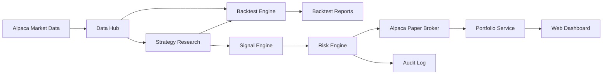

# 美股优先 MVP 推荐方案

版本：v0.1  
日期：2026-04-26  
状态：推荐初稿  

## 1. 推荐结论

第一阶段建议只做美股，不做 A 股。系统目标定为：

1. 美股股票和 ETF。
2. 日线策略优先，分钟线作为第二优先级。
3. 先做研究、回测、模拟盘和人工确认订单。
4. 暂不做全自动实盘。
5. 券商接口先接 Alpaca paper trading，实盘网关预留 IBKR 适配。

推荐组合：

| 模块 | 推荐 | 原因 |
| --- | --- | --- |
| 交易市场 | 美股股票 + ETF | 市场数据和 API 成熟，交易规则相对清晰 |
| 交易频率 | 日线优先，分钟线次之 | 更适合第一版系统，降低数据和执行复杂度 |
| 券商模拟盘 | Alpaca Paper Trading | 免费模拟盘，API 友好，适合快速验证链路 |
| 未来实盘券商 | Interactive Brokers | 覆盖广、账户能力强，适合严肃实盘，但集成复杂 |
| 行情数据 | Alpaca Market Data 起步，后续补 Polygon/Nasdaq Data Link | 起步简单；后续按数据质量和预算升级 |
| 开发语言 | Python | 量化生态成熟，适合数据、回测、任务调度 |
| Web API | FastAPI | 轻量、类型清晰、适合本地和云端部署 |
| 存储 | DuckDB/Parquet + PostgreSQL | 行情/回测用列式文件，交易/配置用关系库 |
| 前端 | React + Vite | 足够构建工作台，生态成熟 |
| 部署 | 本地开发，后续云服务器 | 初期减少运维成本，实盘前再稳定部署 |

## 2. 券商推荐

### 2.1 MVP 使用 Alpaca

推荐先用 Alpaca 的 paper trading 做模拟盘。

适合原因：

1. Paper trading 对所有用户开放，适合先跑通系统。
2. Trading API 和 Market Data API 都有官方 SDK 和文档。
3. Paper 和 Live 的接口形式接近，便于后续迁移。
4. 支持股票和 ETF，下单、撤单、订单状态查询链路清晰。

限制：

1. Alpaca paper trading 只是模拟，不代表真实成交。
2. 免费数据默认有覆盖和限制，严肃回测需要补充更高质量数据。
3. 实盘开户资格取决于居住地、身份和监管要求，需要单独确认。

建议用法：

1. 第一阶段只用 Alpaca paper trading，不接真实资金。
2. 订单统一走系统内部 `broker-gateway`，不要让策略直接调用 Alpaca。
3. 即使使用 Alpaca 模拟盘，也要自己建模滑点、冲击成本和成交失败。

### 2.2 实盘优先考虑 IBKR

如果后续进入真实资金交易，建议优先评估 Interactive Brokers。

适合原因：

1. 市场覆盖广，适合长期扩展。
2. 账户、持仓、订单、保证金和报表能力更完整。
3. 支持 TWS API、Client Portal/Web API 等多种接入方式。

限制：

1. 接入复杂度高于 Alpaca。
2. Web API 对个人用户通常需要已开通并入金的 IBKR Pro 账户。
3. Client Portal Gateway、TWS 或 IB Gateway 的会话管理需要额外工程处理。

建议用法：

1. MVP 不直接接 IBKR 实盘。
2. 第二阶段做 IBKR 只读账户同步。
3. 第三阶段再做人工确认下单。

## 3. 数据源推荐

### 3.1 起步阶段

推荐先使用 Alpaca Market Data。

原因：

1. 和 Alpaca paper trading 集成简单。
2. 能覆盖美股股票和 ETF。
3. 对 MVP 的日线和分钟线研究足够起步。

注意：

1. 免费 Basic 计划的实时股票数据主要是 IEX，历史数据和实时覆盖有计划限制。
2. 如果要做严肃回测，必须记录数据版本、复权方式和公司行动。
3. 不能只依赖一个数据源做最终结论，关键策略上线前建议交叉验证。

### 3.2 进阶阶段

按预算和目标选择：

1. Polygon：适合需要更专业美股历史和实时行情的个人/小团队。
2. Nasdaq Data Link：适合需要正式数据产品、API、历史数据和商业化扩展的场景。
3. Alpha Vantage：适合作为低成本补充数据源，不建议作为唯一严肃回测数据源。

不建议第一阶段使用非正式抓取数据作为核心数据源。可以用于探索，但不能作为策略上线依据。

## 4. 第一批策略推荐

第一阶段不要追求复杂模型，先用简单策略测试系统是否可信。

推荐 3 个策略：

### 4.1 ETF 趋势跟踪

标的：

1. SPY。
2. QQQ。
3. IWM。
4. TLT。
5. GLD。

逻辑：

1. 使用 50 日和 200 日均线。
2. 价格在长期均线上方时允许持仓。
3. 价格跌破长期均线时降低仓位或空仓。

用途：

1. 验证回测引擎。
2. 验证调仓、成本、滑点和报告。
3. 作为低频基准策略。

### 4.2 ETF 动量轮动

标的：

1. SPY。
2. QQQ。
3. IWM。
4. TLT。
5. GLD。
6. XLK、XLF、XLV、XLE 等行业 ETF。

逻辑：

1. 每月或每两周计算 3 到 12 个月动量。
2. 选择排名靠前的 1 到 3 个 ETF。
3. 设置最大单标的仓位和现金保护规则。

用途：

1. 验证多标的组合回测。
2. 验证再平衡和换手率。
3. 验证参数敏感性。

### 4.3 大盘股票低频动量

股票池：

1. 标普 500 成分股。
2. 或流动性前 500 的美股股票。

逻辑：

1. 按 6 到 12 个月动量排序。
2. 过滤低流动性、高波动和近期极端下跌股票。
3. 持有排名靠前的一组股票。
4. 每月调仓。

用途：

1. 验证股票池、成分变更和幸存者偏差处理。
2. 验证组合持仓和行业集中度限制。

## 5. 第一版风险参数建议

仅作为系统默认值，不代表投资建议。

1. 只做多，不做空。
2. 不使用杠杆。
3. 单标的最大仓位：20%。
4. 单行业最大仓位：40%。
5. 单日最大亏损触发暂停：2%。
6. 单策略最大回撤触发暂停：10%。
7. 单笔订单最大金额：账户权益的 10%。
8. 调仓频率：日线策略每日收盘后或次日开盘前生成建议，默认人工确认。
9. 最小成交额过滤：过去 20 日平均成交额不低于指定阈值。
10. 财报日前后是否交易先设为可配置项。

## 6. MVP 交付边界

### 6.1 必做

1. 美股日线数据接入。
2. 股票和 ETF 基础信息。
3. 公司行动处理。
4. 策略接口。
5. 回测引擎。
6. 成本和滑点模型。
7. 回测报告。
8. Alpaca paper trading 连接。
9. 模拟订单和持仓同步。
10. 基础 Web 工作台。
11. 风控规则。
12. 审计日志。

### 6.2 暂缓

1. A 股。
2. 期权。
3. 做空。
4. 杠杆。
5. 盘前盘后。
6. Level 2。
7. 机器学习策略。
8. 全自动实盘。

## 7. 推荐技术架构



建议目录：

```text
apps/
  api/
  dashboard/
packages/
  data_hub/
  strategies/
  backtest_engine/
  risk_engine/
  broker_gateway/
  portfolio/
docs/
  requirements/
  architecture/
  decisions/
```

## 8. 推荐实施顺序

1. 建项目骨架和配置管理。
2. 接 Alpaca Market Data，拉取日线数据。
3. 建 DuckDB/Parquet 行情存储。
4. 实现策略接口和第一个 ETF 趋势策略。
5. 实现日线回测引擎。
6. 生成回测报告。
7. 加入成本、滑点、参数敏感性测试。
8. 接 Alpaca paper trading。
9. 加入风控和人工确认订单。
10. 做 Web 工作台。

## 9. 当前需要你确认的最少信息

为了进入技术设计，只需要先确认这 4 点：

1. 是否接受第一阶段只做美股，不做 A 股？
2. 是否接受第一阶段只做日线策略，分钟线放到第二阶段？
3. 是否可以先用 Alpaca paper trading 做模拟盘？
4. 是否先不接真实资金实盘？

